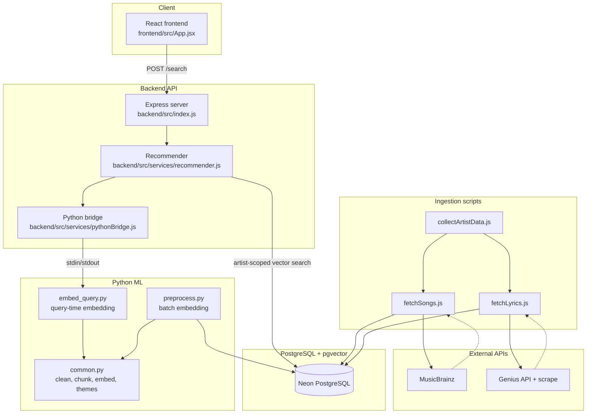
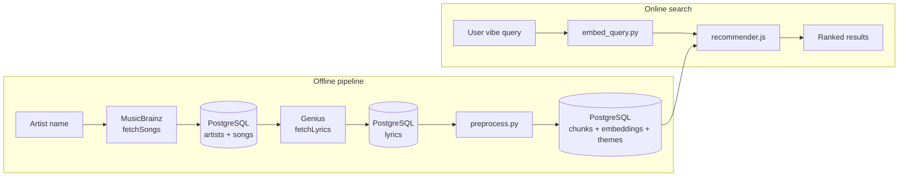
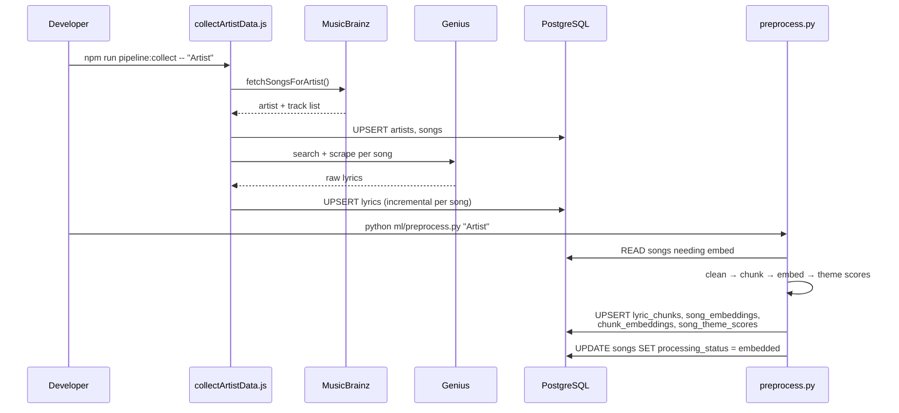
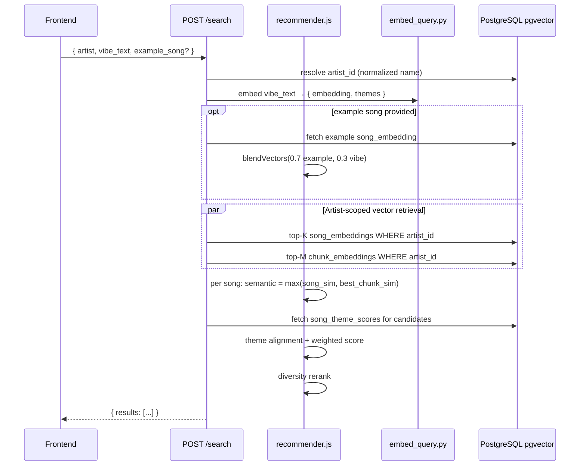
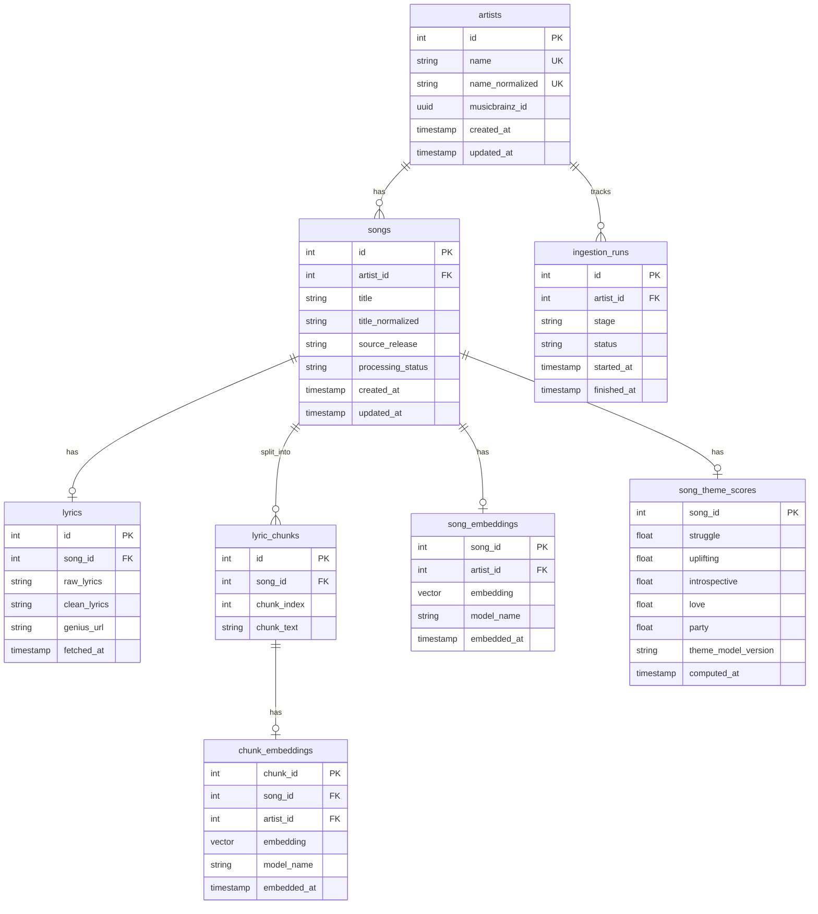

# Lyric Vibe Recommender — Architecture (HLD)

This document describes how the project is structured, how data flows through the system, and how PostgreSQL + pgvector power recommendations.

For setup and commands, see [README.md](../README.md).

---

## 1. System overview

The app recommends songs from **one artist's catalog** based on:

- a **vibe text** query (natural language)
- an optional **example song** to steer the embedding

Recommendations combine:

- **semantic similarity** (whole-song + best lyric-chunk embeddings)
- **theme alignment** (struggle, uplifting, introspective, love, party)
- a light **diversity rerank** to avoid near-duplicate results

```text
final_score = 0.7 × semantic_similarity + 0.3 × theme_alignment
```

If an example song is provided:

```text
query_embedding = 0.7 × example_song_embedding + 0.3 × vibe_embedding
```

**Embedding model:** `all-MiniLM-L6-v2` (384 dimensions, L2-normalized)  
**Storage:** PostgreSQL (Neon) with **pgvector**  
**Source of truth:** database tables — not local JSON files

---

## 2. High-level architecture



### Layers

| Layer | Location | Responsibility |
|-------|----------|----------------|
| Frontend | `frontend/` | Search form, results display, proxies `/search` to backend in dev |
| API | `backend/src/` | HTTP routes, recommendation orchestration |
| Ingestion | `backend/scripts/` | Fetch catalog + lyrics, write to Postgres |
| ML | `ml/` | Lyric cleaning, chunking, embeddings, theme scores |
| Database | `backend/sql/`, `backend/src/db/` | Schema, indexes, queries |

---

## 3. End-to-end data flow



### Song processing statuses

| Status | Meaning |
|--------|---------|
| `pending_lyrics` | Title stored; lyrics not fetched yet |
| `pending_embed` | Raw lyrics stored; not embedded yet |
| `embedded` | Chunks, embeddings, and theme scores stored |
| `skipped_no_lyrics` | No usable lyrics after cleaning |

---

## 4. Ingestion pipeline



### Where to run commands

| Step | Working directory | Command |
|------|-------------------|---------|
| DB schema | `backend/` | `npm run db:migrate` |
| Collect songs + lyrics | `backend/` | `npm run pipeline:collect -- "Artist Name"` |
| Embed + store vectors | project root | `python ml/preprocess.py "Artist Name"` |
| Start API | `backend/` | `npm run dev` |
| Start UI | `frontend/` | `npm run dev` |

### Ingestion scripts

| Script | Role |
|--------|------|
| `fetchSongs.js` | MusicBrainz discography → `artists`, `songs` |
| `fetchLyrics.js` | Genius search + scrape → `lyrics` |
| `collectArtistData.js` | Runs fetch + lyrics in sequence |
| `preprocess.py` | Clean, chunk, embed, score themes → embedding tables |

---

## 5. Recommendation pipeline



### Scoring steps (in `recommender.js`)

1. **Filter by artist** — resolve `artist_id` via normalized name match
2. **Embed query** — Python `embed_query.py` at request time
3. **Optional blend** — mix example song embedding with vibe embedding
4. **Semantic score** — `max(whole-song cosine, best-chunk cosine)` using pgvector `<=>` (cosine distance)
5. **Theme alignment** — cosine between 5-dim theme score vectors
6. **Final score** — `0.7 × semantic + 0.3 × theme`
7. **Diversity rerank** — penalize candidates similar to already-picked songs (`−0.08 × max_sim`)

### Artist-scoped vector search

`artist_id` is **denormalized** onto `song_embeddings` and `chunk_embeddings` so queries never scan the full corpus:

```sql
SELECT song_id, 1 - (embedding <=> $query::vector) AS similarity
FROM song_embeddings
WHERE artist_id = $artist_id
ORDER BY embedding <=> $query::vector
LIMIT 50;
```

B-tree indexes on `artist_id` + HNSW indexes on `embedding` support filtered similarity search.

---

## 6. Database design

### Entity-relationship diagram



### Tables

| Table | Purpose |
|-------|---------|
| `artists` | Canonical artist name + normalized lookup key |
| `songs` | Track metadata, MusicBrainz source info, processing status |
| `lyrics` | Raw scraped lyrics + cleaned full lyrics |
| `lyric_chunks` | Paragraph-style lyric blocks per song |
| `song_embeddings` | One 384-dim vector per song (full lyrics) |
| `chunk_embeddings` | One 384-dim vector per lyric chunk |
| `song_theme_scores` | Five theme similarity scores per song |
| `ingestion_runs` | Pipeline stage logging per artist |

### Key files

| File | Role |
|------|------|
| `backend/sql/schema.sql` | Table definitions + `vector` extension |
| `backend/sql/indexes.sql` | B-tree + HNSW indexes |
| `backend/sql/upgrade.sql` | Migrate from early scaffold schema |
| `backend/src/db/connection.js` | `pg` connection pool |
| `backend/src/db/queries.js` | CRUD + pgvector search queries |

---

## 7. Indexes

### Lookup indexes

| Index | Table | Purpose |
|-------|-------|---------|
| `idx_artists_name_normalized` | `artists` | Fast artist resolution from search input |
| `idx_songs_artist_id` | `songs` | List songs for an artist |
| `idx_songs_artist_title` | `songs` | Dedup by `(artist_id, title_normalized)` |
| `idx_songs_processing_status` | `songs` | Find songs needing lyrics/embed |
| `idx_lyrics_song_id` | `lyrics` | Join lyrics to songs |
| `idx_lyric_chunks_song_id` | `lyric_chunks` | Ordered chunks per song |
| `idx_song_theme_scores_song` | `song_theme_scores` | Theme lookup during ranking |

### pgvector indexes

| Index | Table | Type | Purpose |
|-------|-------|------|---------|
| `idx_song_embeddings_artist` | `song_embeddings` | B-tree | Pre-filter by artist before vector scan |
| `idx_song_embeddings_hnsw` | `song_embeddings` | HNSW (`vector_cosine_ops`) | Fast cosine similarity on whole-song vectors |
| `idx_chunk_embeddings_artist` | `chunk_embeddings` | B-tree | Pre-filter chunks by artist |
| `idx_chunk_embeddings_song` | `chunk_embeddings` | B-tree | Group chunk hits by song |
| `idx_chunk_embeddings_hnsw` | `chunk_embeddings` | HNSW (`vector_cosine_ops`) | Fast cosine similarity on chunk vectors |

Tune search recall vs latency with `HNSW_EF_SEARCH` in `.env` (default `100`).

---

## 8. ML / embedding details

### Theme definitions

Fixed themes in `ml/theme_definitions.py`:

- struggle
- uplifting
- introspective
- love
- party

Theme scores = cosine similarity between the song embedding and each theme description embedding (clamped ≥ 0).

### Chunking

`ml/common.py` splits lyrics on blank lines (paragraph-style blocks). Section markers like `[Chorus]` are stripped before chunking.

### Runtime vs batch Python

| Script | When | I/O |
|--------|------|-----|
| `preprocess.py` | Offline pipeline | Reads/writes PostgreSQL |
| `embed_query.py` | Each `/search` request | stdin JSON → stdout JSON (no DB) |

---

## 9. API contract

### `POST /search`

**Request:**

```json
{
  "artist": "J. Cole",
  "vibe_text": "Introspective",
  "example_song": "4 Your Eyez"
}
```

**Response:**

```json
{
  "results": [
    {
      "title": "4 Your Eyez",
      "artist": "J. Cole",
      "score": 0.82,
      "semantic_similarity": 0.84,
      "theme_alignment": 0.77,
      "youtube_url": "https://www.youtube.com/results?search_query=...",
      "themes": {
        "struggle": 0.20,
        "uplifting": 0.40,
        "introspective": 0.69,
        "love": 0.64,
        "party": 0.09
      }
    }
  ]
}
```

### `GET /health`

Returns `{ ok: true, database: "connected" }` when Postgres is reachable.

---

## 10. Project structure map

```text
personalised_songs/
├── ARCHITECTURE.md          ← this file
├── README.md                ← setup + commands
├── .env.example
├── backend/
│   ├── scripts/             # ingestion + DB utilities
│   ├── sql/                 # schema, indexes, upgrade
│   ├── shared/              # paths, text normalization, fs helpers
│   ├── tests/               # unit tests (npm test)
│   └── src/
│       ├── db/              # connection + queries
│       ├── services/        # recommender, pythonBridge
│       └── utils/           # math (cosine, blend)
├── frontend/
│   └── src/                 # React search UI
└── ml/
    ├── common.py
    ├── preprocess.py
    ├── embed_query.py
    └── theme_definitions.py
```

---

## 11. Environment variables

| Variable | Required | Purpose |
|----------|----------|---------|
| `DATABASE_URL` | Yes | PostgreSQL connection string (Neon) |
| `GENIUS_ACCESS_TOKEN` | Yes (for lyrics) | Genius API access |
| `PORT` | No | Backend port (default `3001`) |
| `PYTHON_BIN` | No | Python executable (default `python`) |
| `SEARCH_RESULT_LIMIT` | No | Max results (default `10`) |
| `HNSW_EF_SEARCH` | No | pgvector search tuning (default `100`) |
| `MUSICBRAINZ_*` | Recommended | MusicBrainz User-Agent metadata |

See [.env.example](./.env.example) for a template.
